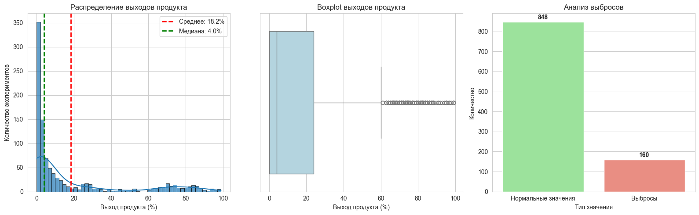
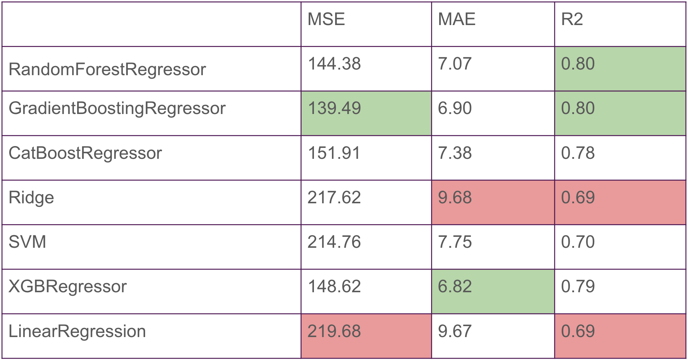

# Predicting-the-reaction-output
In pharmaceutical and chemical research, optimizing reaction conditions to maximize product yield has historically been a resource-intensive process. This empirical approach requires substantial time and financial investment, creating major bottlenecks in drug development and chemical manufacturing.

Our project addresses this challenge by leveraging advanced machine learning techniques, including both classic and ensemble methods and modern neural networks, to predict reaction yields before laboratory experimentation.

**The primary goal:** develop accurate predictive models that can forecast chemical reaction yields based on reaction parameters.

Our project involved a comparison of multiple regression algorithms. The evaluated models were Linear Regression, Ridge, SVM, Random Forest, Gradient Boosting, XGBoost, and CatBoost. The best results were achieved by the Gradient Boosting Regressor, Random Forest Regressor, and XGBRegressor.

### TARGET VARIABLE ANALYSIS



CLASSICAL MACHINE LEARNING MODELS:
- Linear Models
    * LinearRegression
    * Ridge
- Support Vector Methods (SVM)
- Ensemble methods
    * RandomForestRegressor
    * CatBoostRegressor
    * GradientBoostingRegressor
    * XGBRegressor

METRICS BASED ON CLASSIC ML MODELS:



### SIMPLE NEURAL NETWORK:
MODEL ARCHITECTURE:

```python
ChemicalYieldPredictor(
  (network): Sequential(
    (0): Linear(in_features=16, out_features=128, bias=True)
    (1): ReLU()
    (2): Dropout(p=0.2, inplace=False)
    (3): Linear(in_features=128, out_features=64, bias=True)
    (4): ReLU()
    (5): Dropout(p=0.2, inplace=False)
    (6): Linear(in_features=64, out_features=32, bias=True)
    (7): ReLU()
    (8): Linear(in_features=32, out_features=1, bias=True)
  )
)
```

METRICS:

|        | Simple Neural Network |
|--------|-----------------------|
|  MSE   |        215.67         | 
|  MAE   |         8.77          |
|  R2    |         0.69          |

